# 使用说明

1.这是首页index.html

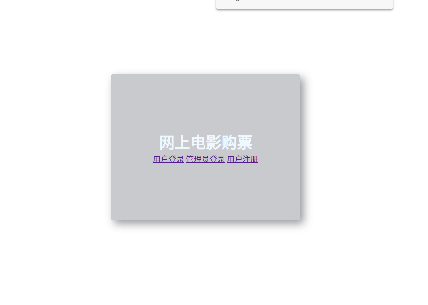

### 分管理员和用户登录，用户没有账户的话可以注册，管理员只有一个账户能登录（用户名wt,密码1246）.

2.这是用户注册register.html

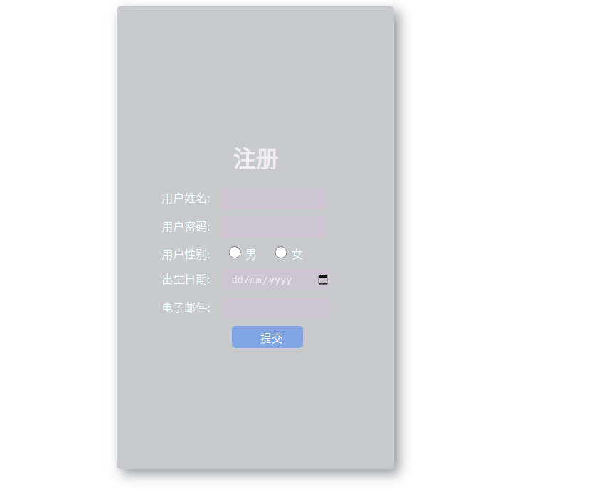

用户可在这个页面完成注册，如果注册重复，则会提示用已存在。

3.用户登录userlogin.html

如果用户完成注册，则会跳转到该页面，若输入账户秘密错误，则会提示

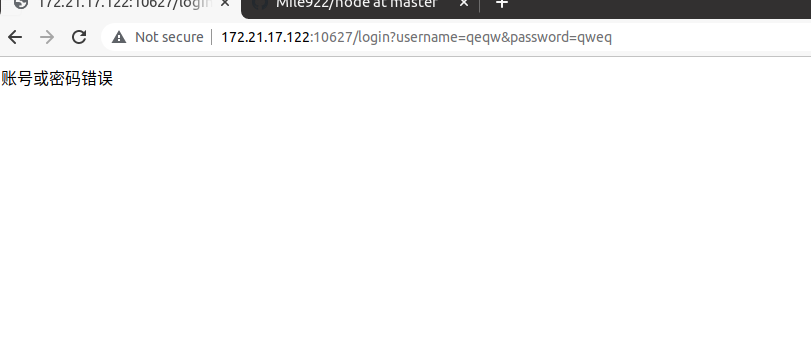

登录成功后来到用户页面user.html，可以根据电影名查询该电影是否在售出

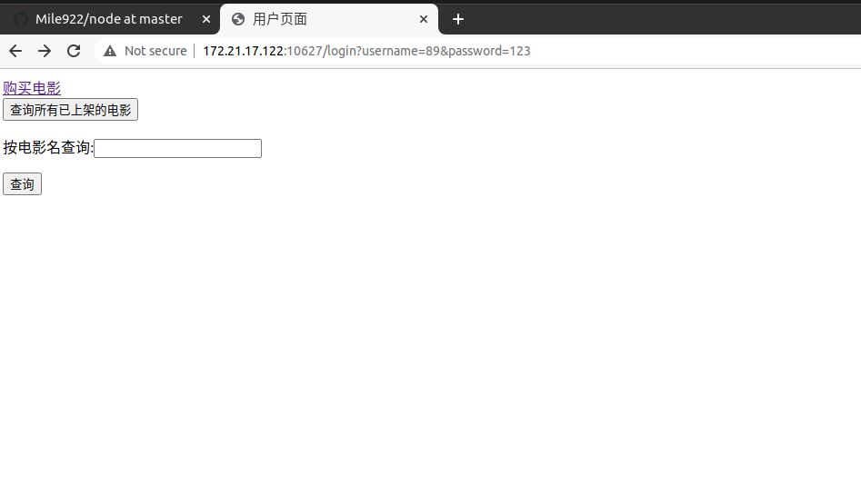

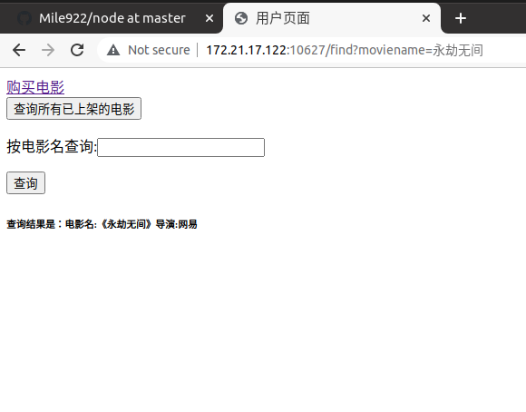

点击购买电影后购买页面buymovie.html,输入信息可以购买，如果该电影不存在则失败

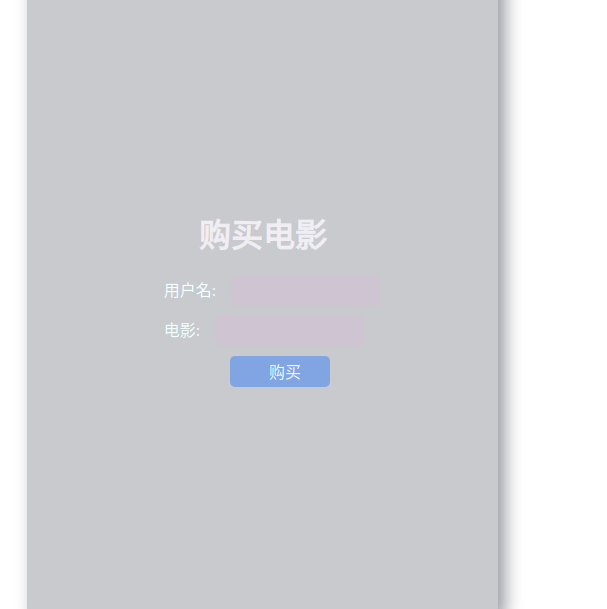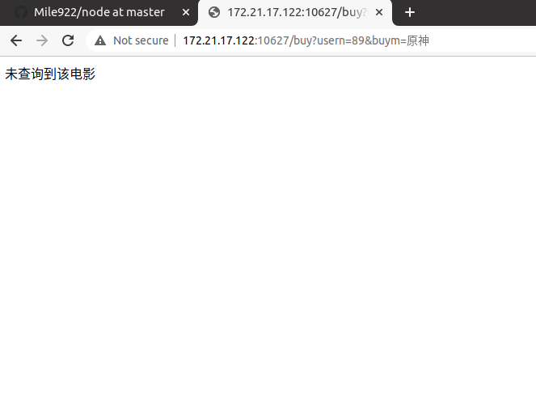

4.管理员登录页面managelogin.html

只有一个管理员用户

账户：wt

密码：1246

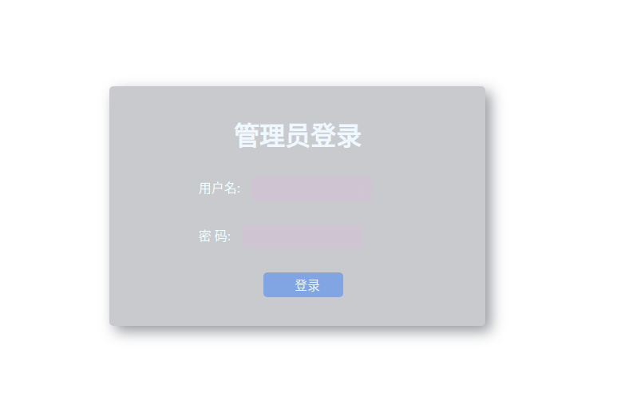

管理员登录成功后跳转：

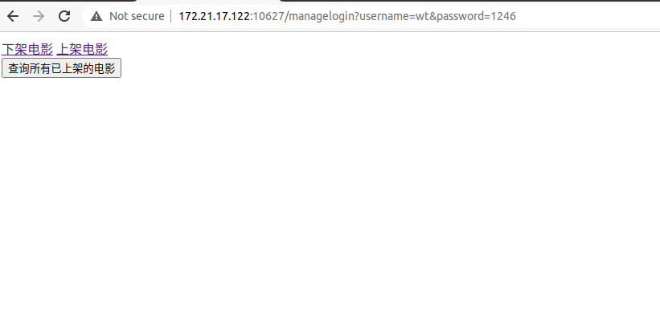

点击查询所有已上架的电影：

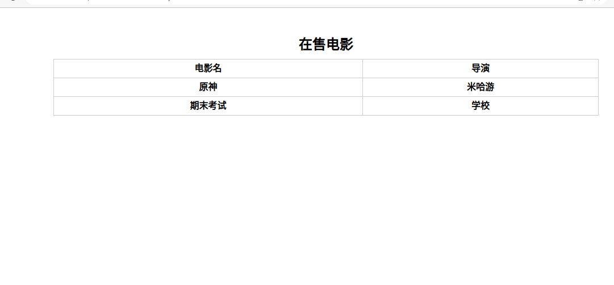

点击上架电影后输出要上架电影的信息，

添加成功：

点击下架电影后，输入电影信息，下架成功

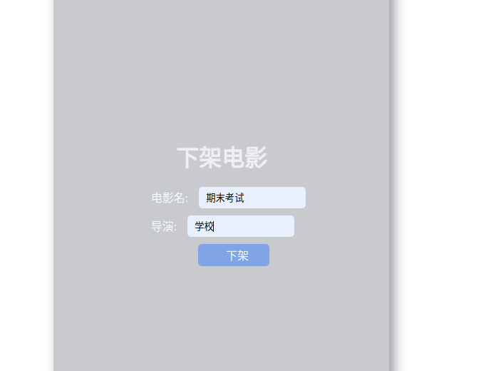

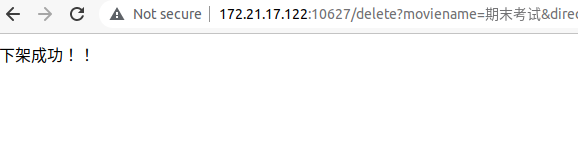

